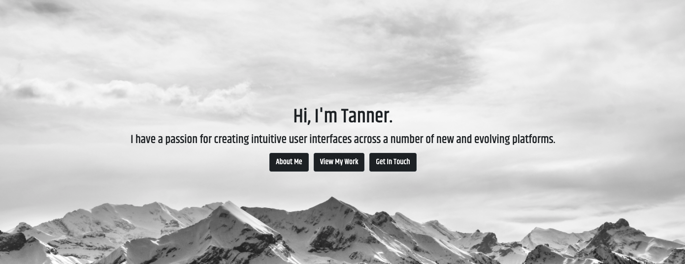

## Hey guys! 👋 I'm Tanner.

#### AS an aspiring software developer  
#### I AM excited to incorporate my skills into the professional realm of software development  
#### SO THAT I can solve real-world problems with the production of quality software

### A Little Bit About Me
👨 28 years old  
🏠 Born and raised in Richmond, Virginia  
📚 Full Stack Bootcamp Student  
⛰️ Outdoor Enthusiast  
✈️ Traveler  
🪕 Music Lover

### 🛠️ What's In My Toolbox?
          

